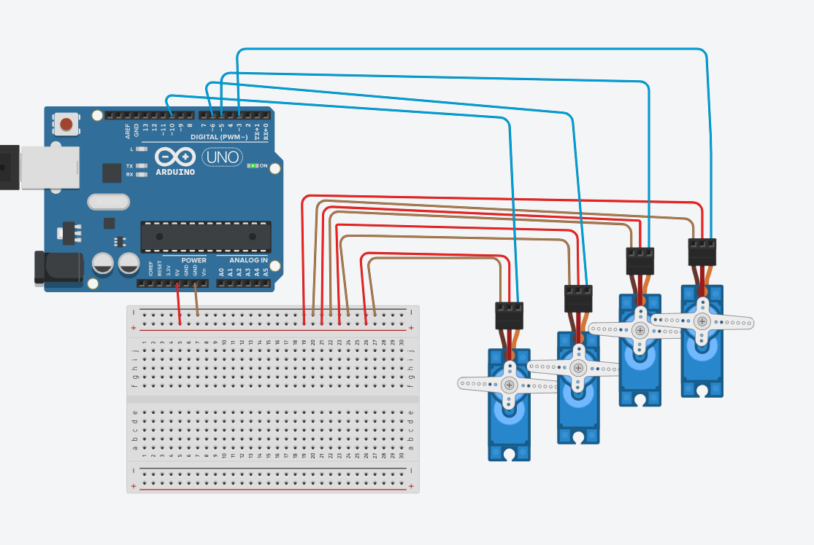

# 4 Servo Motors Sweep and Hold System

A Tinkercad simulation of an Arduino-based system designed to control four micro servo motors simultaneously. The motors perform a synchronized sweep movement for a specific duration before coming to a complete hold at a designated angle.

---

## 📸 Simulation & Preview

### Circuit Diagram
<p align="center">
  
</p>

### Motion Video
https://github.com/tasneem2003mo/Servo-Sweep/blob/main/Servo%20simulation.mp4

---

## ⚙️ How It Works
1. **Synchronized Sweep (First 2 Seconds):** All four micro servos sweep back and forth smoothly between $0^\circ$ and $180^\circ$ concurrently.
2. **Hold State (After 2 Seconds):** The system stops the sweeping loop and commands all four motors to hold a precise static position at $90^\circ$.

---

## 🔌 Hardware Connections
* **Servo 1 (Far Left):** Signal Pin $\rightarrow$ **D3**
* **Servo 2:** Signal Pin $\rightarrow$ **D5**
* **Servo 3:** Signal Pin $\rightarrow$ **D9**
* **Servo 4 (Far Right):** Signal Pin $\rightarrow$ **D10**
* **Common Rails:** 
  * All brown lines $\rightarrow$ breadboard negative $(-)$ rail connected to Arduino **GND**.
  * All red lines $\rightarrow$ breadboard positive $(+)$ rail connected to Arduino **5V**.

---

## 💻 Arduino Code

```cpp
#include <Servo.h>

Servo servo1;
Servo servo2;
Servo servo3;
Servo servo4;

int pos = 0;              
int sweepDirection = 1;   
unsigned long startTime;  
bool timeElapsed = false; 

void setup() {
  servo1.attach(3);
  servo2.attach(5);
  servo3.attach(9);
  servo4.attach(10); 
  
  startTime = millis();
}

void loop() {
  if (millis() - startTime < 2000) {
    servo1.write(pos);
    servo2.write(pos);
    servo3.write(pos);
    servo4.write(pos);
    
    pos += sweepDirection;
    
    if (pos >= 180) {
      sweepDirection = -1;
    } else if (pos <= 0) {
      sweepDirection = 1;
    }
    
    delay(15); 
    
  } else {
    if (!timeElapsed) {
      servo1.write(90);
      servo2.write(90);
      servo3.write(90);
      servo4.write(90);
      timeElapsed = true; 
    }
  }
}
